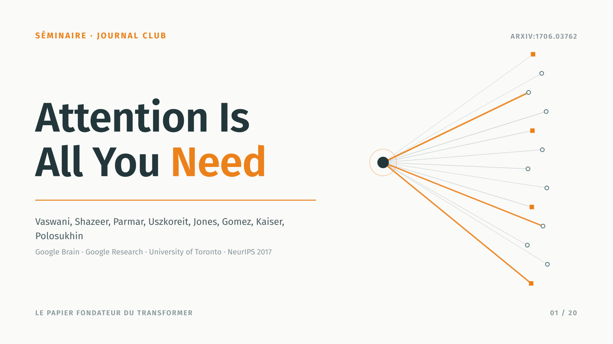
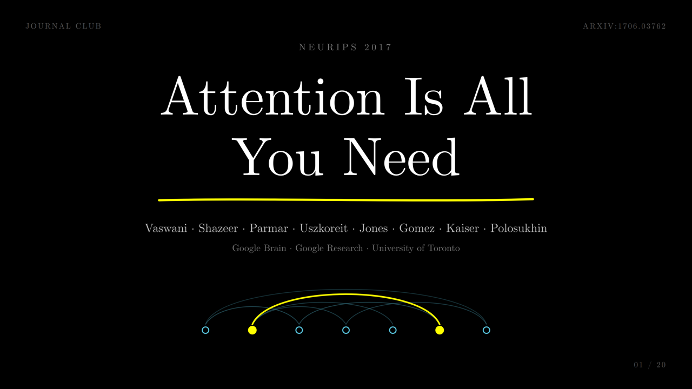
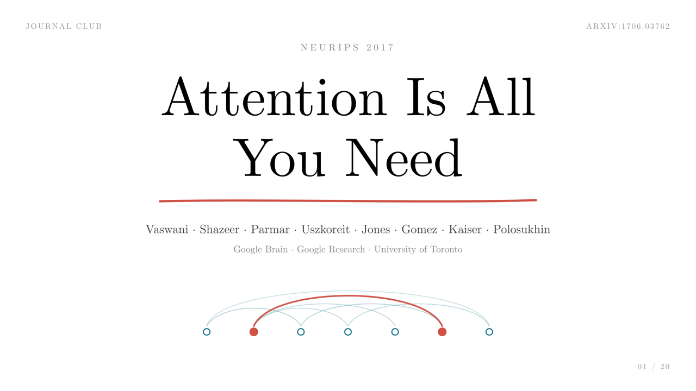
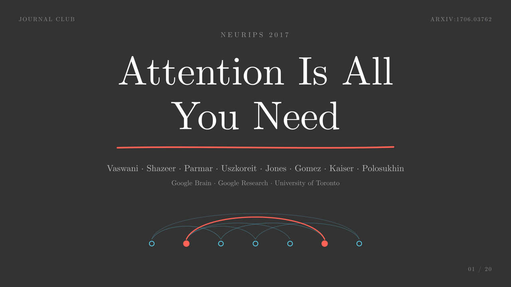

<div align="center">

# claude-presentation-skills

**Presentation skills for [Claude Code](https://claude.com/claude-code).**

Ask for a deck, pick a theme, get a single-file 16:9 HTML presentation:
real LaTeX equations, hand-tuned SVG diagrams, full-anatomy charts,
keyboard navigation, and a pixel-perfect PDF export.

[Themes](#themes) · [Quick start](#quick-start) · [Usage](#usage) · [How it works](#how-it-works) · [Layout](#repository-layout) · [Add a theme](#add-a-theme) · [License](#license)

[](LICENSE)
[](https://claude.com/claude-code)
[](#themes)
[](CONTRIBUTING.md)

</div>

---

## Themes

Four carefully engineered themes, each a faithful reconstruction of a real
visual language:

| | |
|:---:|:---:|
|  |  |
| **`metropolis-deck`** · the modern engineer's beamer | **`3b1b-deck`** · 3Blue1Brown, pure black |
|  |  |
| **`3b1b-light-deck`** · the manim grammar, printed on paper | **`3b1b-gray-deck`** · the manim slate, red emphasis |

| Theme | Look | Best for |
|---|---|---|
| `metropolis-deck` | Off-white, dark teal, single orange accent, Fira Sans, flat and rigorous | Lectures, courses, defenses, bright rooms |
| `3b1b-deck` | Pure black, CMU Serif (the LaTeX font), centered manim scenes, blue + yellow | Videos, projection, mathematical topics |
| `3b1b-light-deck` | The same manim grammar on white paper, red-pen emphasis | Bright rooms with a 3b1b spirit, handouts |
| `3b1b-gray-deck` | manim's default `#333333` slate, white text, red emphasis | Dark but soft, dimmed rooms |

## Quick start

Copy the skills into your project (or into `~/.claude/skills/` to have them
everywhere):

```bash
git clone https://github.com/Redaelm47/claude-presentation-skills.git
cp -r claude-presentation-skills/.claude/skills/* your-project/.claude/skills/
```

Then, in Claude Code:

> Make me a 15-slide presentation on X

The `presentation` skill triggers, asks you to pick a theme (unless you name
one: "3b1b style", "beamer look"), and builds the deck.

## Usage

Every build produces:

- **`index.html`**: the whole deck as **one self-contained file** (fonts
  embedded as base64, no server, no external requests). Open it in a browser.
- **`assets/*.png`**: generated cover and section visuals.
- **A PDF export**: one 16:9 page per slide, driven by the print CSS.

Navigation inside a deck:

| Key | Action |
|---|---|
| **→** / **Space** / click | Next slide |
| **←** | Previous slide |
| **F** | Fullscreen |
| **P** | Print / export to PDF |
| URL `#8` | Deep link to slide 8 |

Manual PDF export from Chrome: **Ctrl/Cmd+P**, landscape, margins *None*,
*Background graphics* checked.

## How it works

The skill set is split into a **process** and **styles**:

- **`presentation`** is the router and the shared production rules: deck
  structure, minimal-text rules, SVG diagram standards (orthogonal routing,
  contrast checks), chart anatomy, LaTeX compiled to SVG at build time
  (MathJax), and a **mandatory visual QA loop**: every slide is screenshotted
  and inspected before delivery, then iterated until zero defects.
- **Each theme** is a style card + a canonical `deck-template.html` (CSS,
  navigation, print layout, diagram primitives) + its fonts. The build copies
  the template and replaces the content, so every deck inherits the exact
  visual grammar of its theme.

Build tooling (used by the skill, not by the viewer): Node.js with `mathjax@3`
and `playwright-core` for headless rendering, screenshots and PDF export.

## Repository layout

```
.claude/skills/
├── presentation/            # the router: process, rules, build scripts
│   └── scripts/             # mkfonts · tex2svg · render · qa · pdf
├── metropolis-deck/         # one directory per theme:
├── 3b1b-deck/               #   SKILL.md (style card)
├── 3b1b-light-deck/         #   reference/deck-template.html (canonical impl.)
└── 3b1b-gray-deck/          #   fonts/ + fonts.manifest.json
docs/previews/               # theme preview images (this README)
```

## Add a theme

Create `.claude/skills/<name>-deck/` following the theme contract (style
`SKILL.md`, `reference/deck-template.html` with placeholders,
`reference/build-canvases-example.js`, `fonts/` + manifest), then register it
in the router table of `.claude/skills/presentation/SKILL.md`.
See [CONTRIBUTING.md](CONTRIBUTING.md) for the details.

## License

[MIT](LICENSE). The bundled fonts (CMU Serif, Fira Sans) remain under their
original license, the [SIL Open Font License 1.1](https://openfontlicense.org).
